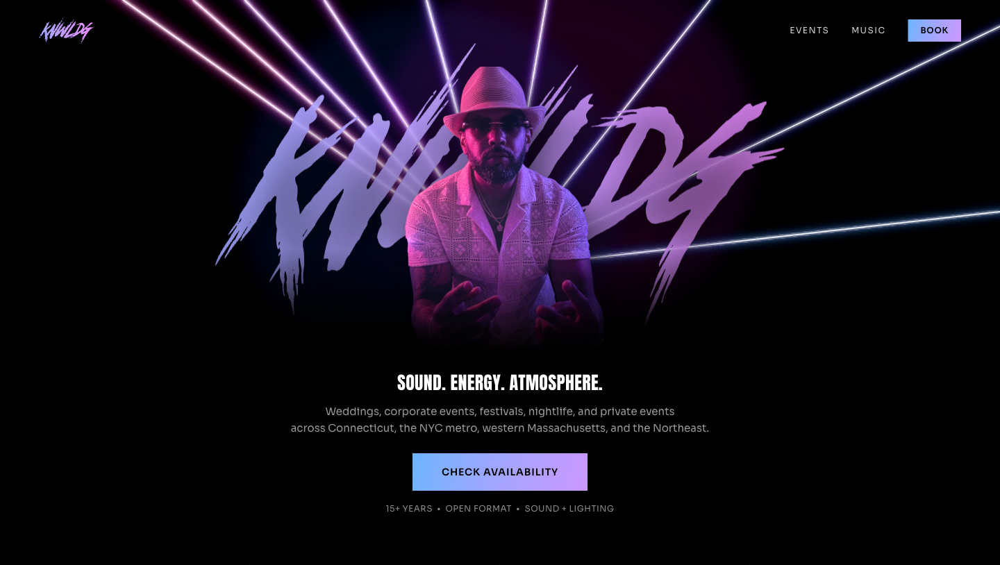
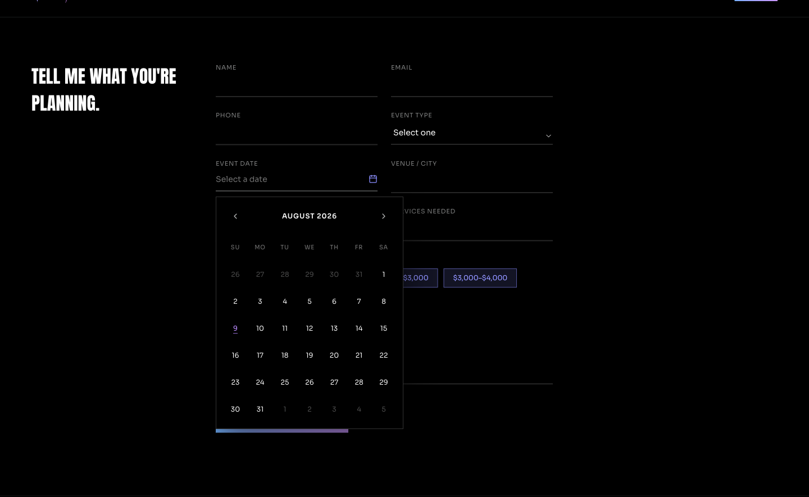
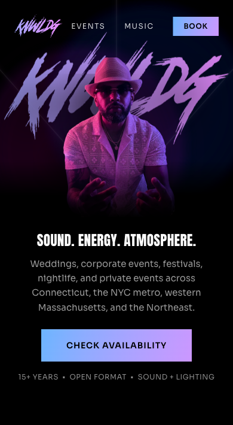
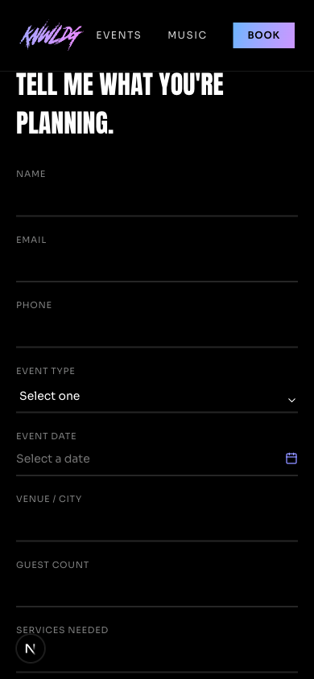

# KNWLDG Audit Roadmap

**Last verified:** August 10, 2026
**Scope:** Current working tree, not only the last Git commit
**Product goal:** Help event planners understand KNWLDG's fit and confidently submit a date-first booking inquiry
**Roadmap status:** 19 workstreams reconciled from the original audit drafts

## How to use this file

This is the canonical audit and implementation tracker. Update the status table and the verification checklist whenever work lands. Do not copy the original audit drafts forward; several of their findings were already outdated or overstated.

Status labels:

- **Complete** — implemented and confirmed in code or in this audit run.
- **Partial** — useful implementation exists, but a named gap remains.
- **Pending** — not implemented or not configured in this repository.
- **Accepted / N/A** — reviewed and intentionally not treated as a defect.

## Executive status

| Status | Count | Summary |
|---|---:|---|
| Complete | 9 | Rate limiting, date policy, booking tests, submit feedback, lazy hero, images, reduced motion, strict TypeScript, design system |
| Partial | 4 | WebGL lifecycle verification, lint/CI enforcement, responsive/device verification, production sender rollout |
| Pending | 5 | Honeypot telemetry, deduplication, structured logs, analyzer wiring, error tracking |
| Accepted / N/A | 1 | Decorative laser canvas does not need an ARIA interaction label |

The production build, lint, and 15 booking-focused tests pass. The booking endpoint now enforces a shared sliding limit and a New York business-date policy. Production sender verification and a real delivery/reply test remain external launch steps.

## Reconciled workstreams

| ID | Workstream | Status | Priority | Verified evidence and adjustment |
|---|---|---|---|---|
| A01 | Booking rate limiting | **Complete** | — | Upstash Redis now applies a 10-attempt sliding one-hour limit before body parsing. Identifiers are HMAC hashes, analytics is off, Vercel environments have separate prefixes, timeouts fail open after one second, and missing production configuration returns `503`. Tests verify attempts 1–10, attempt 11, and independent client buckets. |
| A02 | Event-date validation | **Complete** | — | The shared schema requires a real ISO date on or after the current `America/New_York` business date. The calendar disables earlier days and prevents navigation before the allowed month. Tests cover malformed, impossible, yesterday, today, future, and New York midnight boundaries. |
| A03 | WebGL cleanup and memory safety | **Partial** | P1 | The original audit called this a confirmed critical leak without runtime evidence. Current code disposes beam geometry, explicitly loses the hardware-probe context, and unmounts the canvas when the tier becomes `off`. GPU/context profiling across mount, resize, tier change, and revisit is still required. |
| A04 | Honeypot telemetry | **Pending** | P1 | Bot submissions intentionally receive silent success, but no privacy-safe structured event is recorded. Implement only after the logging policy is defined. Do not log form contents or raw email addresses. |
| A05 | Duplicate-submit protection | **Pending** | P1 | The button is disabled during the active request, which prevents ordinary double-clicks, but the API has no idempotency key or replay protection. |
| A06 | Automated test runner | **Complete** | — | Vitest is configured with `test` and `test:watch` scripts. Fifteen tests cover business-date boundaries, schema validation, rate-limit behavior, route ordering, honeypot handling, configuration failure, and the Resend envelope. Laser tests remain a separate future expansion. |
| A07 | ESLint and CI enforcement | **Partial** | P1 | `npm run lint` exists and passes using Next 16's flat ESLint config. The old recommendation to add `next lint` is invalid for this project. No repository CI workflow was found, so lint/build/test enforcement is still pending. |
| A08 | Structured server logging | **Pending** | P1 | The booking route still uses `console.error`. Define redaction first, then add event-shaped logs for configuration failure, provider failure, rate limiting, and honeypot activity. |
| A09 | Lazy-load the Three.js hero | **Complete** | — | `laser-hero-scene-loader.tsx` uses `next/dynamic`, `ssr: false`, capability tiers, an idle/timer gate, and visibility-aware frame control. The original eager-load finding is outdated. |
| A10 | Image optimization | **Complete** | — | Production React components use `next/image`; no production `` elements were found. The static design-system HTML is documentation and is not part of the app's image pipeline. |
| A11 | Bundle analyzer | **Pending** | P2 | `@next/bundle-analyzer` is installed, but `next.config.ts` and `package.json` do not expose an analyze mode. Wire it in and record a baseline before setting a budget. |
| A12 | Booking submit feedback | **Complete** | — | The form retains `Sending...`, disables controls during submission, exposes `aria-busy`, and announces success or user-safe `429`/`503` errors through polite live regions. |
| A13 | Reduced-motion experience | **Complete** | — | Reduced motion intentionally selects the static CSS fallback. Do not add a pulsing animation by default; that would work against the user's preference. Revisit only after user testing shows a real comprehension problem. |
| A14 | Hero responsiveness and device tiers | **Partial** | P2 | Fresh captures passed at `1440 × 1000` and `390 × 844`. The loader also listens for resize and orientation changes. Tablet widths, coarse-pointer devices, low-memory hardware, and actual GPU behavior remain unverified. |
| A15 | ARIA label for laser hero | **Accepted / N/A** | — | The laser canvas is decorative, has `pointer-events: none`, and is wrapped with `aria-hidden`. Pointer motion changes ambience but is not required to understand or operate the page. Adding an interactive label would create screen-reader noise. |
| A16 | Production error tracking | **Pending** | P2 | No Sentry or equivalent integration was found. Add only after deciding the deployment target, alert ownership, sampling, and data-redaction policy. |
| A17 | TypeScript strictness | **Complete** | — | `tsconfig.json` has `strict: true`; no explicit `any` types were found in production TypeScript. The production build's type check passes. |
| A18 | Design-system/component reference | **Complete** | — | `public/designsystem.html` documents color, type, layout, gradients, buttons, chips, the calendar, and motion. It is reachable through the `/designsystem` rewrite. |
| A19 | Production Resend sender domain | **Partial** | P0 before launch | The testing fallback is removed and all three email variables are required. `.env.example` locks the sender and recipient. Resend domain verification, Vercel configuration, and a real delivery/reply test still require the account owner. |

## Prioritized roadmap

### Phase 0 — Booking launch blockers

Target: make the inquiry endpoint safe and business-correct before production promotion.

- [x] **A01 — Add durable rate limiting**
  - Upstash Redis, 10 attempts per IP per sliding hour, HMAC identifiers, environment-specific prefixes, and `429` headers are implemented and tested.

- [x] **A02 — Validate event dates in schema and calendar**
  - Exact `YYYY-MM-DD` values are checked against the New York business date on client and server; calendar and boundary tests are in place.

- [ ] **A19 — Verify the production sender identity**
  - Confirm `djknwldg.com` is verified in Resend and add the provider's exact SPF/DKIM records if needed.
  - Set the Upstash, salt, and three email variables in Vercel Preview and Production.
  - Send a real delivery test and check SPF, DKIM, DMARC, reply-to behavior, and spam placement.

**Phase 0 exit:** repeated abuse is throttled, invalid dates cannot reach email, and a production-domain message is delivered to the real inbox.

### Phase 1 — Reliability and change safety

- [ ] **A08 — Define and implement structured logging** with explicit redaction rules.
- [ ] **A04 — Add honeypot/rate-limit events** without storing form contents or raw personal information.
- [ ] **A05 — Add idempotency/replay protection** using a request key stored with a bounded TTL.
- [x] **A06 — Add Vitest and focused booking tests.** Provider-failure and idempotency coverage can expand with those later workstreams.
- [ ] **A07 — Add CI** that runs lint, tests, and a production build. Continue using `eslint`; do not add the removed `next lint` command.
- [ ] **A16 — Choose error tracking** only after alert ownership and data policy are clear.

**Phase 1 exit:** one command sequence proves lint, types/build, and tests; booking failures and abuse paths are diagnosable without exposing personal data.

### Phase 2 — Performance verification

- [ ] **A11 — Wire the bundle analyzer** and save the initial route/chunk baseline.
- [ ] **A03 — Profile WebGL lifecycle** on mount/unmount, full-to-reduced, reduced-to-off, resize, background/foreground, and repeated visits.
- [ ] **A14 — Complete the device matrix** at 375, 390, 768, 1024, and desktop widths, including coarse pointer, reduced motion, save-data, and low-core tiers.
- [ ] Record LCP, CLS, interaction readiness, transferred JavaScript, live WebGL contexts, and GPU/JS memory before proposing more hero changes.

**Phase 2 exit:** performance work is driven by measured bottlenecks, not the old unverified estimate that Three.js adds approximately 500KB gzip or that a leak is already proven.

### Phase 3 — Form and accessibility polish

- [x] **A12 — Mark the form busy while submitting**, preserve the existing `Sending...` label, and stop inputs from changing mid-request.
- [x] Announce success and error messages through polite live regions.
- [ ] Run automated contrast/semantic checks, then manually test keyboard order, visible focus, calendar navigation, error recovery, 200% zoom, and touch target sizes.
- [ ] Keep **A13** static for reduced-motion users unless research supports another behavior.
- [ ] Keep **A15** decorative and hidden from assistive technology unless the laser becomes a meaningful control.

**Phase 3 exit:** the complete booking path works by keyboard and touch, communicates validation and request state, and reflows without loss of content.

## Fresh audit evidence

All screenshots below were captured and inspected during this audit run.

### Step 1 — Desktop landing and hero: healthy



- Strong performer-first hierarchy and a direct booking call to action.
- The dynamic laser scene is visually active without blocking the core copy or CTA.
- Screenshot evidence cannot prove transfer size, LCP, GPU cleanup, or reduced-motion behavior.

### Step 2 — Desktop booking form: healthy with reliability gaps



- Labels, grouped budget choices, visible focus treatment, and a branded calendar are present.
- Past dates are disabled and earlier-month navigation is blocked, matching the server policy in A02.
- Screenshot and DOM evidence support the visible structure, but a screen reader and full keyboard pass are still required.

### Step 3 — Mobile hero: healthy



- The performer, headline, supporting copy, and primary CTA remain clear at 390px.
- No visible horizontal overflow or clipped hero content was observed.
- Actual low-power devices and tablet orientations remain part of A14.

### Step 4 — Mobile booking entry: healthy with verification gaps



- The form reflows into a readable single column with persistent access to navigation.
- Field labels and underline affordances remain visible; the date picker trigger is clearly recognizable.
- Contrast ratios, touch target dimensions, lower-form content, and zoom resilience require dedicated testing before making an accessibility claim.

### Step 5 — Launch-blocker booking QA: passed locally

- The production build was exercised at `1440 × 1000` and `390 × 844` on August 10, 2026.
- Past days and previous-month navigation were disabled; today and future dates were selectable by pointer and keyboard.
- Real local `503`, mocked `429`, and mocked success responses produced the intended user-safe message or success status in the accessibility tree.
- During a delayed request, the form exposed `aria-busy="true"`, disabled its controls and submit button, and displayed `Sending...`.
- This local pass does not replace the required Vercel preview rate-limit test or the real Resend delivery/reply test.

## Current strengths to protect

- Performer-led hero and strong brand continuity.
- Clear booking path from both navigation and hero CTA.
- Semantic headings, native form labels, and grouped budget radios.
- Dynamic/capability-gated Three.js scene with a static first paint.
- Reduced-motion behavior that removes motion rather than substituting another animation.
- Strict TypeScript, modular components, and a clean production build.
- Central design-system reference for the five-color system, gradients, Sora UI typography, calendar, and component states.

## Evidence limits

This audit combines current repository inspection, lint/build/type verification, direct schema checks, DOM snapshots, and fresh browser screenshots. It does not establish full WCAG compliance, production email deliverability, real-user performance, cross-browser compatibility, WebGL memory behavior, bot resistance, or monitoring coverage. Those claims require the named runtime, device, provider, and accessibility tests in the roadmap.

## Verification commands

Run these after each implementation phase:

```bash
npm run lint
npm run test
npx next build --webpack
```

`npm run test` runs the booking-focused Vitest suite.

## Decision log

| Date | Decision | Reason |
|---|---|---|
| 2026-08-09 | Replaced two attached audit copies with this single canonical file. | The attachments are byte-for-byte identical. |
| 2026-08-09 | Reconciled the drafts into 19 distinct workstreams. | The earlier “16 items” summary omitted or merged several detailed findings. |
| 2026-08-09 | Kept only rate limiting and date validation as confirmed technical P0 gaps. | Both are directly supported by current route/schema evidence. |
| 2026-08-09 | Moved WebGL cleanup from “confirmed critical leak” to P1 runtime verification. | Cleanup code exists; no heap/GPU evidence proves a leak. |
| 2026-08-09 | Removed the recommendation to add reduced-motion pulsing. | Static output better respects the explicit reduced-motion preference. |
| 2026-08-09 | Marked the laser ARIA-label item N/A. | The scene is decorative, non-operational, and already hidden from assistive technology. |
| 2026-08-09 | Replaced the obsolete `next lint` recommendation with direct ESLint plus CI. | This project uses Next 16 and already has a passing `eslint` script. |
| 2026-08-10 | Locked Vercel, Upstash Redis, 10 attempts per hour, and New York as the booking timezone. | These decisions close the implementation ambiguity in A01 and A02. |
| 2026-08-10 | Locked the sender and recipient and removed all production email fallbacks. | Misconfiguration now fails safely instead of attempting to use a testing identity. |
| 2026-08-10 | Accepted both direct Upstash and Vercel Marketplace Redis variable names. | The installed Marketplace resource injects `KV_REST_API_*`; supporting both pairs avoids duplicating secrets. |

## Next checkpoint

Complete the external half of A19: add a private `RATE_LIMIT_SALT`, wait for
`djknwldg.com` verification in Resend, redeploy, and complete one real
delivery/reply test. Vercel and its US-region Upstash database are connected,
and the three booking email variables are configured. After that, Phase 0 is
ready to close.
